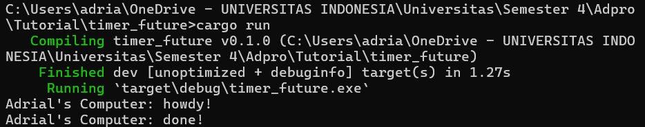
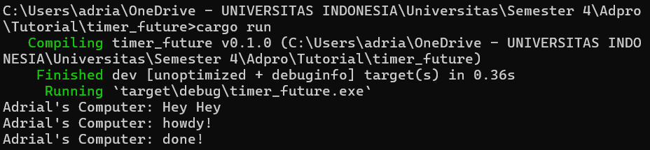
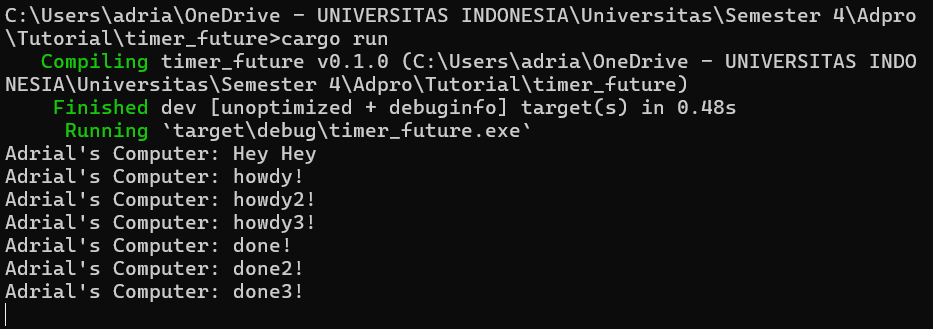

Exercise 1.1:

Exercise 1.2:

Based on the observation of the output, it can be understood that what happens is the async function will run outside of the main function that executes it. Therefore, "hey hey" might appear as the output before "howdy!" and "done!" because "hey hey" is outside the async function as the function will continue the program and execute `print!("hey hey");` while the async function is still waiting for the result from the future.

Exercise 1.3:

From the output generated, it can be observed that the presence of multiple spawners leads to more tasks being performed because more tasks are queued into the task sender, which acts like a message queue. The spawners not being dropped means the program never terminates because it assumes that data will continue to be sent by the spawners. The `drop(spawner)` is an indication that the interaction has finished and the spawner will be closed. When a spawner calls the spawn function, a new task is created and channeled into the task sender. The executor will take one task from the task sender and execute it, then continue to take tasks until there are no more tasks and the spawner is dropped, signaling the end of the interaction.

